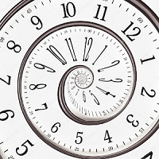

## Code-A-Clock Workshop
#### An introduction to programming, using the Processing.org Java sketchbook

Workshop created for use as a demonstration lab session for UoB open days / applicant visit days.

https://lukestorry.co.uk/code-a-clock/

### Workshop Objective: Reinvent the Clock

##### The overall objective of this workshop is simple: Have fun, while learning some basic programming concepts to create your own version of a clock or some other form of measuring time.

However, do feel free to let your creativity run wild... feel free to go 'off piste' and go beyond the challenges we've laid out here. Who knows, you might just reinvent the concept of time! 😜

---

## What is Processing?
#### In this activity we use [Processing](https://processing.org), a Java based flexible software sketchbook.

_If you are doing this workshop in a lab on a University Visit Day, then Processing will already be installed and set up on half of your screen. If not, [Click Here](https://processing.org/tutorials/gettingstarted/) for more info on getting started. _

Processing is easy for creating visual art with a few simple lines, and is ideal for learning how to code. There are both Javascript and Java variants, but today we'll be using the Java.

The Processing programming environment might seem familiar to those of you who have used an Integrated Development Environment _(IDE)_ before, however experience with IDE’s is not a prerequisite for this workshop, so do not worry if some of this looks unfamiliar at first!

Students, artists, designers, researchers, and hobbyists use Processing for learning and prototyping projects.
[Visit this link](https://processing.org/exhibition/) to see some of the examples of interesting prototypes and projects.

---
### Timings
This workshop was created for Applicant Visit Days at the University of Bristol, and the rough timings for each secion are below:
- 14:15 Intro
- 14:20 Intro to Processing - Drawing Program
- 14:35 Clock Program Challenges - Playing with Time
- 14:50 Group Work - Design a New Clock
- 15:10 Presentations

---

Adapted from Pete Bennet's- https://tinyurl.com/y9cuqury
